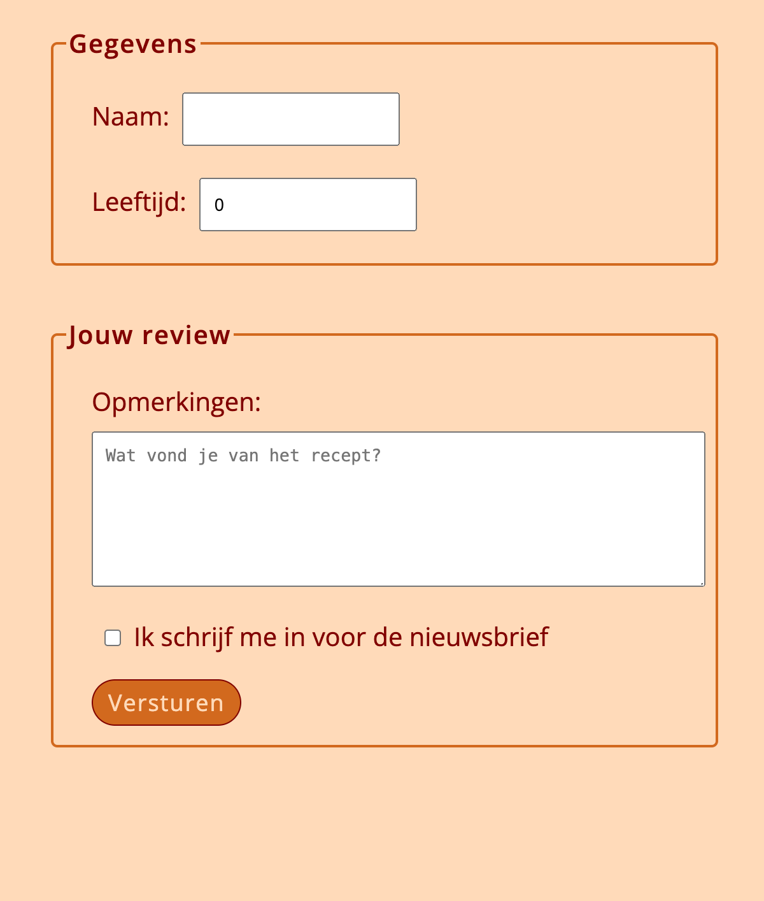
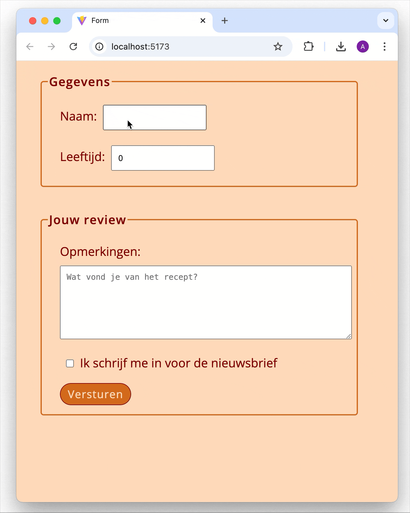

# React Controlled Form – NOVI Frontend Module

This repository contains my solution for the React Controlled Form exercise from the Frontend Development module at [Novi University](https://www.novi.nl).

The goal of this assignment is to practice working with **React State** and **controlled components** by building a simple form with multiple input types.

## Table of Contents

- [Tech Stack](#tech-stack)
- [Key Features](#key-features)
- [Preview](#preview)
- [Project Setup](#project-setup)
- [Credits](#credits)
- [License](#license)

---

## Tech Stack

- **React** (v18.2.0)
- **Vite**
- **HTML5**
- **CSS3**
- **JavaScript ES6+**
- **Node.js** & **NPM**

---

## Key Features

- Form with controlled components using React `useState` hook for state management.
- Inputs include:
    - Text input for **Name**
    - Number input for **Age**
    - Textarea for **Comments**
    - Checkbox for **Newsletter subscription**
- Form submission handled via a **submit** button.
- State updates in real time as user interacts with the form inputs.

---

## Preview

<details>
<summary><strong> React Controlled Form Screenshot </strong></summary>



</details>



> Simple React form demonstrating controlled inputs and state handling.


---

## Project Setup

1. Clone or open the repository in an IDE

2. Install dependencies
   ```bash
   npm install
   ```
3. Start the development server
   ```bash
   npm run dev
   ```
4. Open your browser at http://localhost:5173 to view the app.


## Credits

> This assignment, visual designs and base project setup were created and provided by **Novi University** as part of the Frontend module.

---

## License

> "This project is for **educational purposes only**. All images, designs, and dummy content are to be used for learning and non-commercial use."

---